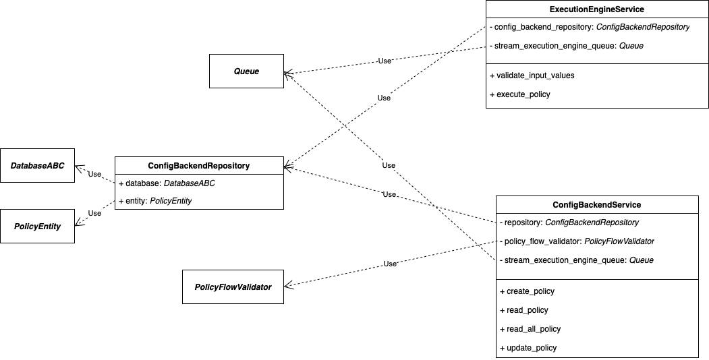

# Backend

The backend is completely empty and up to you to build.
You can use any tech you think would suit this challenge well.

# Solution's design decisions

## Structure

The solution uses **_FastAPI_** and **_Uvicorn_**.

I designed the architecture with three layers: **Controllers**, **Services** and **Repositories**.
* _Controllers_: Endpoints and their schemas.
* _Services_: Solution's rules and workflows.
* _Repositories_: Interactions with databases.

I also separated the solution into two domains: **ConfigBackend** and **ExecutionEngine**. Each of them contains the
mentioned layers.

All of those parts are connected through a _dependency injection setup_ which roughly translates to the following *UML*:

* _DatabaseABC_ component: it's a python's ABC where all databases' drivers implementation must inherit, the solution
also have a **_database factory_** i.e. use its `register`  decorator on driver's implementation python class

## Assumptions

In order to effectively run the solution, two main points were crucial: Validations of a policy and _**ExecutionEngine**_

In order to validate a policy, I assumed (_based on the instructions.md_) that it's structure would be composed of blocks where 
the allowed types are: `start`, `condition` and `end`. Also, Each of them has required properties and rules. ([validators.py](src%2Fdomain%2Fconfig_backend%2Fservices%2Fconfig_backend%2Fvalidators%2Fpolicy_flow%2Fvalidators.py)).

Now the _ExecutionEngine_, in order to reflect instant changes to a policy, I've made it as a `async_generator` which means
that once a client request its endpoint, It keeps the connection open and streams responses, it also performs some
validations on request e.g. does the input matches the policy.
